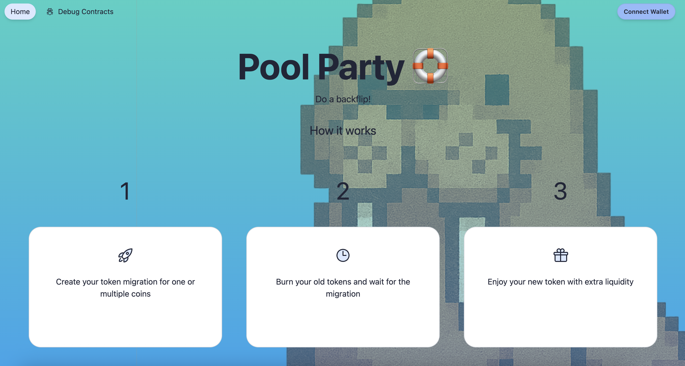
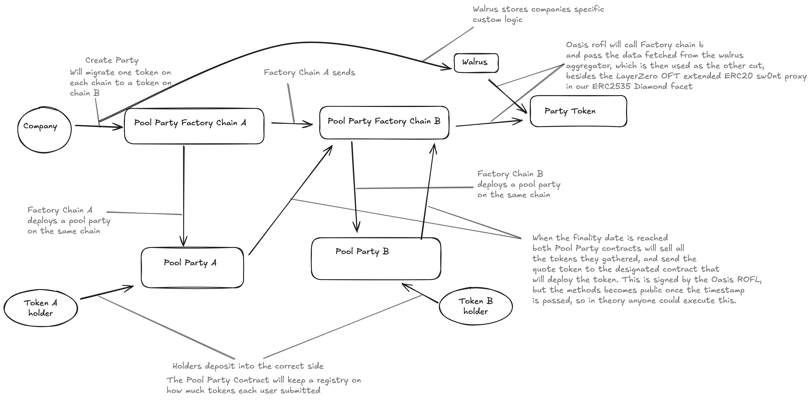

<h1 align="center">
🏊🏊‍♀️🏊‍♂️ Pool Party ️🏊🏊‍♀️🏊‍♂️
</h1>

<h4 align="center">
  <a href="https://sloths-warsaw.vercel.app/">Website</a> |
  <a href="https://devfolio.co/projects/sloth-shaming-bea7">Devfolio</a>
  

    
  

</h4>

🦭 As crypto matures, more and more companies with already existing tokens and holders will merge, both as companies, and probably as tokens too. While it is better for rebranding, this is usually a very capital inefficient process where old liquidity gets stuck and companies will just have to add aditionall liquidity into a new pool. Pool Party is a platform that allows companies to create a deposit phase, and then have the old liquidity bootstrap the new company and ecosystem, while users will get their verifiable fair share of the pie. 🍰

- ⛓️ **Cross Chain**: Thanks to LayerZero we can support multiple different evms, and the new token created will be a OFT token, meaning it will be crosschain out of the box.
- 💎 **Shine bright like a Diamond**: Companies won't want to deploy a plain ERC20 token. Therefore, we allow companies to sideload their custom functions in the contract with the help of ERC2535 Diamond proxies
- 💰 **Dynamic Amounts of Tokens**: No matter how many tokens you're merging, we got you.
- 👕 **TEEs**: All computations are safe and verifiable, thanks to Oasis ROFL. 

## Party Finality Date 

If you find a sloth, there is the possibility to post a roast for this slow payee on x dot com the everything app in a single click

## Diagrams
### Full flow, from company party creation to token deployment

## Bounties 😎

### Request Network - Best app that creates requests
We created a reputation system for to create, query and update reputation for Request Network.

### BuidlGuidl - Best Scaffold-ETH2 Submission
We initialized the project using Scaffold-ETH 2 with the [SE2 Request Network extension](https://github.com/arjanjohan/scaffold-request-extension). 

### Worldcoin - Best Use of World ID 
We use Worldcoin World ID for preventing sybil and spam attacks, to ensure a more fair and robust reputation system.

## Next steps

- We want to bring this tool primarly in the hands of hackathons in order for hackers to be able get a picture of the credibility of a company and wether or not they are likely to pay the bounties to the winning hackers.

## Links

- [Devfolio](https://devfolio.co/projects/sloth-shaming-bea7)
- [Vercel](https://sloths-warsaw.vercel.app/)
- [Github](https://github.com/PoolPartyCannes/PoolParty)

### Deployments
- [Deployment Celo](https://explorer.celo.org/alfajores/address/0x81afFbf9392a1402B44B8b6C45C89F602657b3eF)
- [Deployment Sei](https://seitrace.com/address/0xF519289Ed67326514c6Eb47851f9e605DC8ad640?chain=pacific-1)

## Team

- [Mikael](https://x.com/poisonedfunctor)
- [0xjsi.eth](https://x.com/0xjsieth)